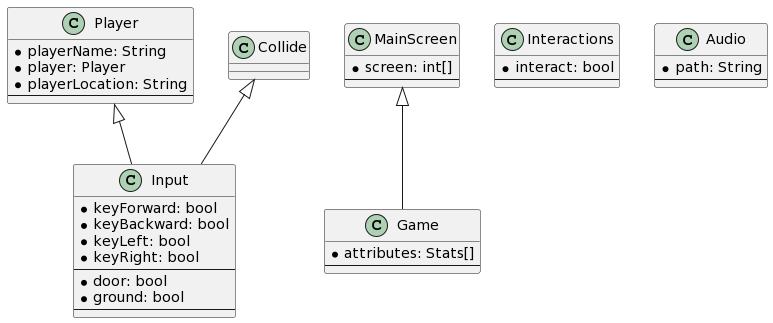
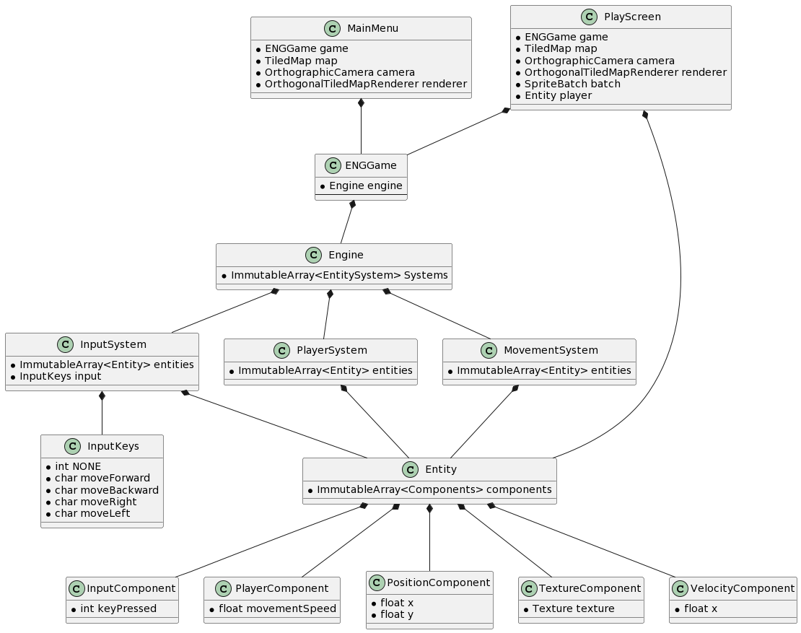
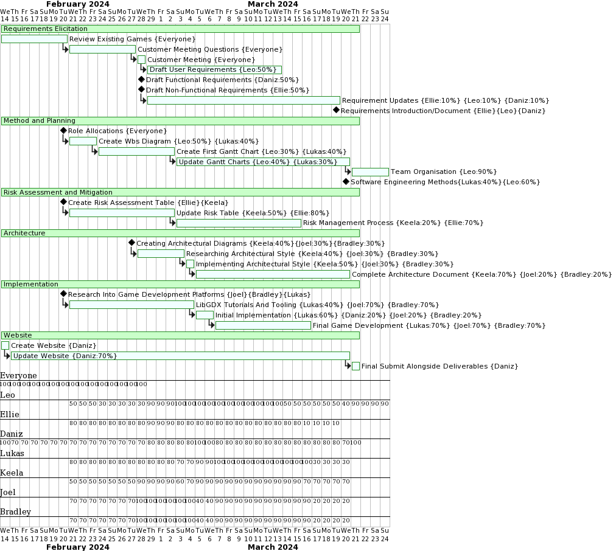
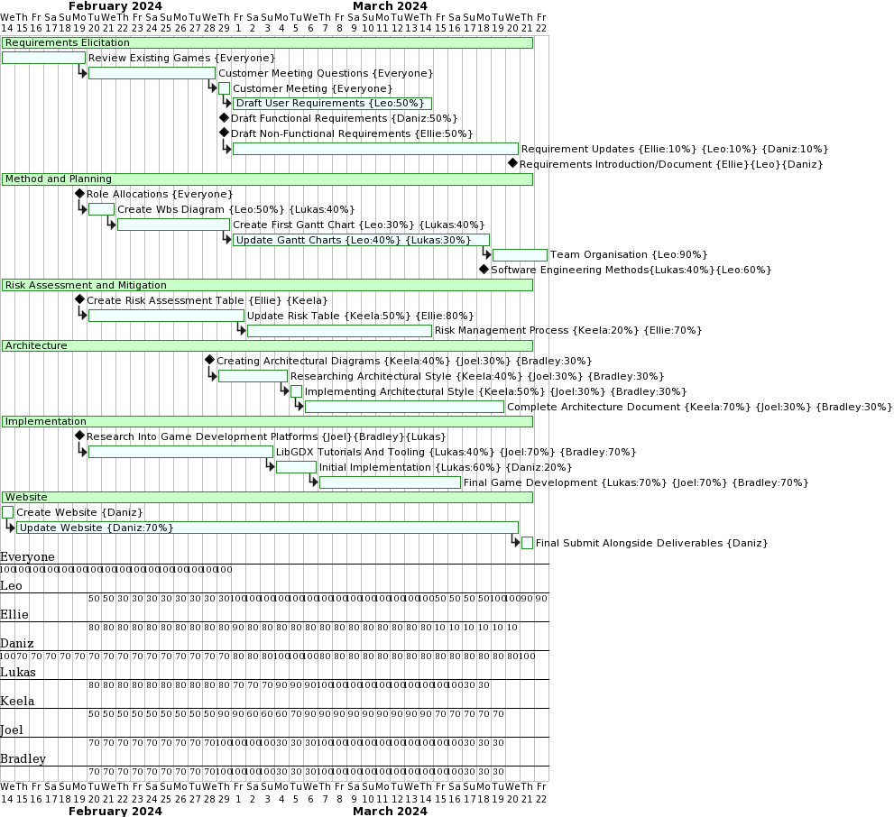
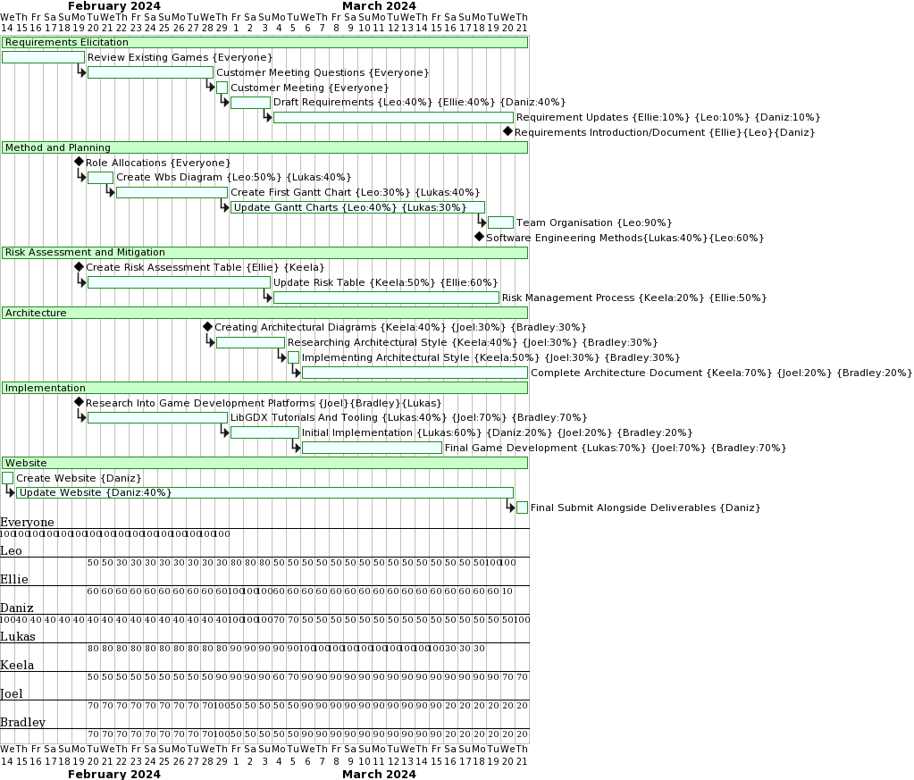
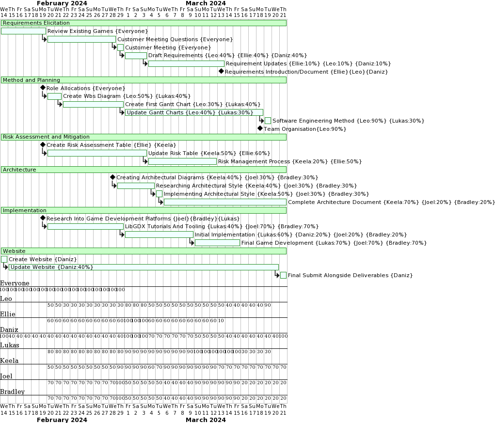
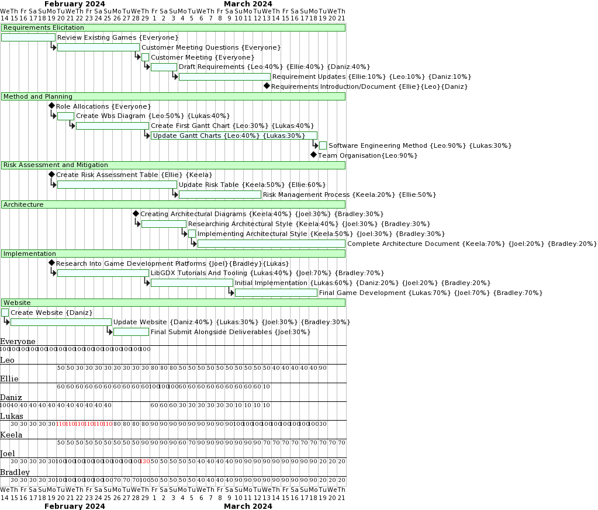

## Group Project (ENG1)

# Requirements:
[Link](Req1.pdf)

# Architecture:
[Link](Arch1.pdf)

### Message-Based Architecture

(Pre-implementation)

### Entity-Component System

(Mid-Implementation)

# Method Selection and Planning:
[Link](Plan1.pdf)

### Week 1 - (G1)

### Week 2 - (G2)

### Week 3 - (G3)

### Week 4 - (G4)

### Week 5 - (G5)

### Week 6 - (G6)

# Risk assessment and mitigation:
[Link](Risk1.pdf)

# Implementation:
[Link](Impl1.pdf)

## Javadocs
[Link](javadocs/index.html)

# Executable JAR:
[Link](Heslington-Hustle.jar)

# Version Control Repository:
[Link](https://github.com/danizhajizada/team14-main)
